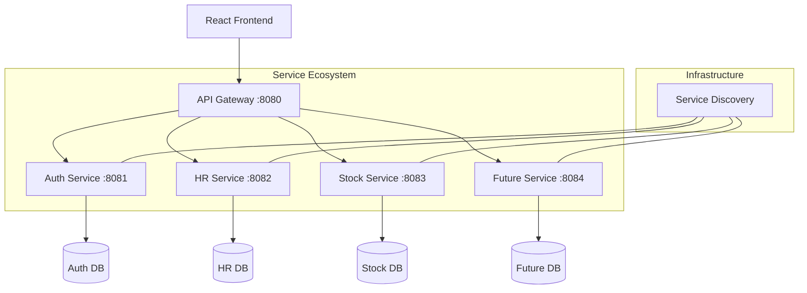

# 🚀 MTP Microservices Migration & Implementation Guide

This document is your master roadmap and technical manual for transitioning from a monolithic Spring Boot application to a distributed, scalable microservices ecosystem.

---

## 🏗️ 1. The Target Architecture

We are splitting the application into specialized domains to improve security, scalability, and reliability.



---

## 📋 2. Phase 1: Infrastructure Setup (The Foundation)

### 2.1 Service Discovery (Eureka Server)
The "Receptionist" of your app. Every service registers here.
- **Location**: `mtp-discovery-server`
- **Port**: `8761`
- **Setup**: Add `@EnableEurekaServer` to the main class.

### 2.2 API Gateway (Spring Cloud Gateway)
The "Front Door" for the React app. It handles all routing.
- **Location**: `mtp-api-gateway`
- **Port**: `8080`
- **Setup**: Configure routes in `application.yml` to point to `lb://service-name`.

---

## 📋 3. Phase 2: Domain Splitting & Service Creation

| Service | Responsibilities | Key Entities |
| :--- | :--- | :--- |
| **Auth Service** | Login, JWT, Roles, Permissions | `User`, `Role`, `Permission` |
| **HR Service** | Staff Management, Biometrics | `Employee`, `Attendance`, `Payroll` |
| **Stock Service** | Equipment, Inventory | `InventoryItem`, `Category` |
| **Future Service** | Social Work, Training | `Client`, `Placement`, `Case` |

### Step-by-Step for New Services:
1. **Dependency**: Add `spring-cloud-starter-netflix-eureka-client`.
2. **Config**: Set `spring.application.name` and the Eureka server URL in `application.properties`.
3. **Register**: The service will automatically check in with Eureka on startup.

---

## 📋 4. Phase 3: Inter-Service Communication

Since services no longer share a database, use **OpenFeign** for service-to-service calls.

**Example**: `Future Service` calling `HR Service`:
```java
@FeignClient(name = "mtp-hr-service")
public interface HRClient {
    @GetMapping("/api/employees/{id}")
    EmployeeDTO getEmployee(@PathVariable Integer id);
}
```

---

## ⚡ 5. CAP Theorem & Resilience Principles

To ensure a professional-grade system, every service must follow these rules:

1. **Consistency (C)**: Use `@Version` (Optimistic Locking) in your database models to prevent data clashes.
2. **Availability (A)**: Use **Caffeine Caching** to keep the UI fast even if the database is under load.
3. **Partition Tolerance (P)**: Implement **Retry Logic** for external calls (like Cloudinary) to handle internet flickers.

---

## 💻 6. Frontend Integration (ReactJS)

The React app should only talk to the Gateway (**Port 8080**).

1. **Proxy Update**: Set the Vite proxy target to `http://localhost:8080`.
2. **Unified API**: All requests to `/api/**` and `/ws/**` now go through the Gateway.

---

## 🛠️ 7. Next Steps for the Team
1. **Split the Gradle Build**: Move to a multi-project Gradle structure.
2. **Externalize Config**: Move database credentials to a central Config Server.
3. **Database Migration**: Use Liquibase or Flyway to split the single database into four separate schemas.

---

**Proprietary Document for MTP Enterprise Systems.** 🚀✨
